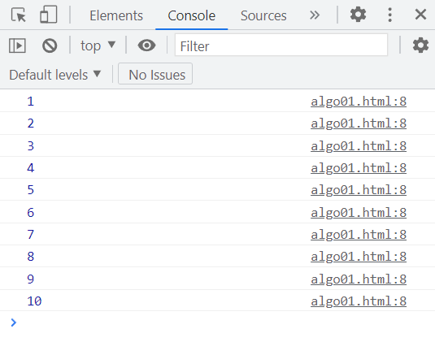
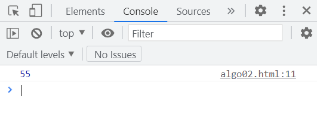
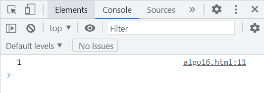
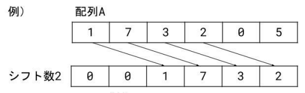
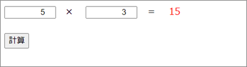

# JavaScript アルゴリズム演習

本演習問題用のフォルダ（以下、演習フォルダ）を作成して各演習を進めてください。

<br>

## 基本文法編

変数、分岐構造、反復構造、配列を使ってアルゴリズムに取り組みます。console.log関数を使用して、ブラウザの開発者ツールのコンソールに結果を表示しましょう。

<br>

### 演習1（algo01.html）

1 ～ 10 までの数字をコンソールに出力してください。ただし、console.log関数の使用は1回のみとします。

<br>

**algo01.html**

```html
<!DOCTYPE html>
<html lang="jp">
    <head>
        <meta charset="UTF-8">
        <title>JavaScript Algorithm</title>
        <script type="text/javascript">
            // 処理
        </script>
    </head>
    <body>
    </body>
</html>
```

<br>

**＜期待結果＞**



<br><br>

[解答例](./ans/algo01.html)

<br><br>

### 演習2（algo02.html）

1 ～ 10 までの合計をコンソールに出力してください。

<br>

**＜期待結果＞**



<br><br>

[解答例](./ans/algo02.html)

<br><br>

### 演習3（algo03.html）

1 ～ 10 までの偶数の合計をコンソールに出力してください。

<br>

**＜期待結果＞**


<br><br>

[解答例](./ans/algo03.html)

<br>

### 演習4（algo04.html）

変数x、変数y、変数zの変数を用意し、次の初期値を代入します。その後、変数x は 変数y の値に、変数y は 変数z の値に、変数z は 変数x の値になるよう入れ替えてコンソールに出力してください。

<br>

**＜初期値＞**

- 変数x = 10
- 変数y = 20
- 変数z = 30

<br>

**＜期待結果＞**


<br><br>

[解答例](./ans/algo04.html)

<br><br>

### 演習5（algo05.html）

1、3、5、7、9 とコンソールに出力してください。

<br>

**＜期待結果＞**


<br><br>

[解答例](./ans/algo05.html)

<br><br>

### 演習6（algo06.html）

121 + 123 + 125 + ・・・ + 251 の結果をコンソールに出力してください。

<br>

**＜期待結果＞**


<br><br>

[解答例](./ans/algo06.html)

<br><br>

### 演習7（algo07.html）

変数に試験の点数を代入し、80点以上は「優」、50点以上80点未満は「良」、30点以上50点未満は「可」、30点未満の結果をコンソールに出力してください。

<br>

**＜期待結果＞**　※変数 = 80 の場合


<br><br>

[解答例](./ans/algo07.html)

<br><br>

### 演習8（algo08.html）

変数aに数値（整数）を代入し、数値が3の倍数のときは "3の倍数"、5の倍数のときは "5の倍数"、7の倍数のときは "7の倍数"、11の倍数は "11の倍数" とコンソールに表⽰してください。例えば、変数aが 231 の場合は "3の倍数" と "7の倍数" と "11の倍数"を表⽰します。

<br>

**＜期待結果＞**　※変数a = 231 の場合


<br><br>

[解答例](./ans/algo08.html)

<br><br>

### 演習9（algo09.html）

変数aに数値（整数）を代入し、数値が10以上のときはその数値をコンソールに表⽰してから 3で除算します。数値が10よりも⼩さくなるまで繰り返してください。ただし、始めに代入する数値が10より⼩さいときは何も表⽰しません。

<br>

**＜期待結果＞**　※変数aが270の場合


<br><br>

### 演習10（algo10.html）

2つの変数に数値（正の整数）を代入し、四則演算の加算を使⽤して数値の乗算を求めてコンソールに表示してください。乗算の演算⼦は⽤いないものとします。

<br>

**＜期待結果＞**　※変数1 = 5、変数2 = 3 の場合


<br><br>

### 演習11（algo11.html）

変数に数値（整数）を代入し、正の数のときは "+1"、負の数のときは "-1" をコンソールに表示してください。なお、数値が0のときは何も表示しません。

<br>

**＜期待結果＞**　※変数 = -3 の場合


<br><br>

### 演習12（algo12.html）

変数に数値（整数）を代入し、絶対値をコンソールに表示してください。ただし、四則演算と判断のみ使⽤するものとします。

<br>

**＜期待結果＞**　※変数 = -5 の場合


<br><br>

### 演習13（algo13.html）

2つの変数に数値（整数）を代入し、それぞれが同符号なら "+1"、異符号なら "-1" をコンソールに表示してください。なお、いずれかの数値に0が含まれる場合は "-1" を表示するものとします。

<br>

**＜期待結果＞**　※変数1 = 5、変数2 = 2 の場合


<br><br>

### 演習14（algo14.html）

5個の整数を持つ配列を用意し、その中に1つでも負の数があれば "-1"、すべてが正の数なら "+1" をコンソールに表示してください。

<br>

**＜期待結果＞**　※配列 = [1, 2, 3, 4, -5] の場合


<br><br>

### 演習15（algo15.html）

変数に 0 または 1 を代入し、1なら "0" を、0なら "1" をコンソールに表示してください。ただし、NOT演算⼦は使わないものとします。

<br>

**＜期待結果＞**　※変数 = 1 の場合


<br><br>

### 演習16（algo16.html）

2つの変数に 0 または 1 を代入し、その論理和をコンソールに表示してください。ただし、OR演算⼦は使わないものとします。

<br>

**＜期待結果＞**　※変数1 = 1、変数2 = 0 の場合



<br><br>

### 演習17（algo17.html）

2つの変数に 0 または 1 を代入し、その論理積をコンソールに表示してください。ただし、AND演算⼦は使わないものとします。

<br>

**＜期待結果＞**　※変数1 = 1、変数2 = 1 の場合


<br><br>

### 演習18（algo18.html）

変数に数値（正の整数）を代入し、その階乗をコンソールに表示してください。<br>nの階乗n! = 1 ✕ 2 ✕ 3 ✕ ・・・ ✕ n

<br>

**＜期待結果＞**　※変数 = 5 の場合


<br><br>

### 演習19（algo19.html）

"★"を3行5列でコンソールに表示してください。なお、必要な数の"★"を変数に文字列結合して出力するものとします。

> console.log関数では表示と同時に自動的に改行されてしまうため

<br>

例）"★"を横⼀列に5個表⽰する処理。

```javascript
（中略）
  <script type="text/javascript">
    let stars = "";

    for (let i = 1; i <= 5; i++) {
      // 変数starsに"★"を文字列結合する
      stars = stars + "★";
    }

    // 結合した文字列をコンソールに表示する
    console.log(stars);
  </script>
（中略）
```

<br>

**＜期待結果＞**


> 3行表示はされていませんが、❸が"★★★★★"を3回表示していることを表しています。

<br><br>

### 演習20（algo20.html）

"★"を1⾏⽬に1個、2⾏⽬に2個、・・・、5⾏⽬に5個というようにコンソールに表示してください。なお、必要な数の"★"を変数に文字列結合して出力するものとします。

<br>

**＜期待結果＞**


<br><br>

### 演習21（algo21.html）

"★"を期待結果のような形でコンソールに表示してください。なお、必要な数の"★"と"　"（全角スペース）を変数に文字列結合して出力するものとします。

<br>

**＜期待結果＞**


<br><br>

### 演習22（algo22.html）

"★"を期待結果のような形でコンソールに表示してください。なお、必要な数の"★"と"　"（全角スペース）を変数に文字列結合して出力するものとします。

<br>

**＜期待結果＞**


<br><br>

### 演習23（algo23.html）

配列 = [56, 89, 72, 63, 91] の合計をコンソールに表示してください。

<br>

**＜期待結果＞**


<br><br>

### 演習24（algo24.html）

配列 = [56, 89, 72, 63, 91] の最大値をコンソールに表示してください。

<br>

**＜期待結果＞**


<br><br>

### 演習25（algo25.html）

配列 = [56, 89, 72, 63, 91, 0] の 1 ～ 5番目の数値の合計値を、配列の6番目に格納し、配列をコンソールに表示してください。

<br>

**＜期待結果＞**


> 配列をそのまま表示することができます。

<br><br>

### 演習26（algo26.html）

変数にシフト数を代入し、配列 = [1, 7, 3, 2, 0, 5] をシフト数だけ右シフトします。シフト前とシフト後の配列をコンソールに表示してください。なお、配列の空いた部分には0を代入します。



<br><br>

**＜期待結果＞**　変数（シフト数） = 2 の場合


<br><br>

### 演習27（algo27.html）

下図の数値の入った配列Aと配列Bがあり、不一致な数値の個数をコンソールに表示してください。


<br><br>

**＜期待結果＞**


<br><br>

### 演習28（algo28.html）

各要素に1字ずつ文字の入った配列があります。

```javascript
let array = ["H", "e", "l", "l", "o", "@", , , , ,];
```

配列に入っている文字の数をコンソールに表示してください。文字列の最後には終わりを示す記号「@」が入っています。


<br><br>

**＜期待結果＞**


<br><br>

### 演習29（algo29.html）

配列 = [56, 89, 72, 63, 91] の隣り合う要素を最初から見ていき、大きさが逆であれば入れ替えて昇順に並び変えます（バブルソート）。ソート前とソート後の配列をコンソールに表示してください。

<br>

**＜期待結果＞**


<br><br>

### 演習30（algo30.html）

次のコードで初期値を持たない要素9の配列を用意します。

```javascript
let steps = Array(9);
```

配列の各要素に各段で乗算した値を格納し、九九表をコンソールに表示してください。

<br>

**＜期待結果＞**


<br>
<hr>
<br>

## DOM編

DOMを使ってアルゴリズムに取り組みます。

<br><br>

### 演習31（algo31.html）

テキストボックスに点数を入力し、80点以上は「優」、50点以上80点未満は「良」、30点以上50点未満は「可」、30点未満の結果をコンソールに出力してください。

<br>

**algo31.html**

```html
<!DOCTYPE html>
<html lang="jp">
<head>
  <meta charset="UTF-8">
  <title>JavaScript Algorithm</title>
  <script type="text/javascript">
    function judgement() {
      // 処理
    }
  </script>
</head>
<body>
  <form>
    <div>
      <label for="score">点数：</label>
      <input type="number" id="score" value="0" min="0" max="100">
    </div><br>
    <button type="button" onclick="???">判定</button>
  </form>
</body>
</html>
```

<br>

**＜期待結果＞**　※テキストボックスに80を入力して判定ボタンを押した場合


<br><br>

### 演習32（algo32.html）

2つのテキストボックスに数値（正の整数）を入力し、四則演算の加算を使⽤して数値の乗算を求めてコンソールに表示してください。乗算の演算⼦は⽤いないものとします。

<br>

**algo32.html**

```html
<!DOCTYPE html>
<html lang="jp">
<head>
  <meta charset="UTF-8">
  <title>JavaScript Algorithm</title>
  <style type="text/css">
    input[type="number"] {
      width: 80px;
      text-align: right;
    }
    #answer {
      color: #FF0000;
    }
  </style>
  <script type="text/javascript">
    function calc() {
      // 処理
    }
  </script>
</head>
<body>
  <form>
    <div>
      <input type="number" id="num1" value="0" min="0">　×　
      <input type="number" id="num2" value="0" min="0">　＝　
      <span id="answer"></span>
    </div><br>
    <button type="button" onclick="calc()">計算</button>
  </form>
</body>
</html>
```

テキストボックスの入力値で四則演算をするときは、parseInt関数で整数型に変換する必要があります。

```javascript
let num1 = parseInt(document.querySelector('#num1').value);
```

<br>

**＜期待結果＞**　※5 と 3 を入力して計算ボタンを押した場合


<br><br>

### 演習33（algo32.html）

演習32で、計算の結果をコンソールではなく、id="answer" の spanタグに出力（表示）してください。

<br>

**＜期待結果＞**　※5 と 3 を入力して計算ボタンを押した場合


<br><br>

### 演習34（algo34.html）

5つのテキストボックスに数値を入力し、その中に1つでも負の数があれば "-1"、すべてが正の数なら "+1" をアラートで表示してください。

<br>

**algo34.html**

```html
<!DOCTYPE html>
<html lang="jp">
<head>
  <meta charset="UTF-8">
  <title>JavaScript Algorithm</title>
  <script type="text/javascript">
    function evaluation() {
      // 処理
    }
  </script>
</head>
<body>
  <form>
    <div>
      <label>整数1：</label>
      <input type="number" class="number" value="0">
    </div>
    <div>
      <label>整数2：</label>
      <input type="number" class="number" value="0">
    </div>
    <div>
      <label>整数3：</label>
      <input type="number" class="number" value="0">
    </div>
    <div>
      <label>整数4：</label>
      <input type="number" class="number" value="0">
    </div>
    <div>
      <label>整数5：</label>
      <input type="number" class="number" value="0">
    </div><br>
    <button type="button" onclick="evaluation()">評価</button>
  </form>
</body>
</html>
```

<br>

**＜期待結果＞**　※1、2、3、4、-5 を入力して評価ボタンを押した場合



<br><br>

### 演習35（algo35.html）

テキストボックスにフルーツ名を入力し追加ボタンを押したら、フルーツ一覧（ulタグ）に入力したフルーツ名を追加表示してください。フルーツ名が未入力の場合は一覧に追加しません。

<br>

**algo35.html**

```html
<!DOCTYPE html>
<html lang="jp">
<head>
  <meta charset="UTF-8">
  <title>JavaScript Algorithm</title>
  <script type="text/javascript">
    function addFruit() {
      // 処理
    }
  </script>
</head>
<body>
  <h2>フルーツ一覧</h2>
  <ul id="fruits-list">
    <li>Apple</li>
    <li>Banana</li>
    <li>Cherry</li>
  </ul>
  <form>
    <input type="text" id="fruit">
    <button type="button" onclick="addFruit()">追加</button>
  </form>
</body>
</html>
```

<br>

**＜期待結果＞**　※1、2、3、4、-5 を入力して評価ボタンを押した場合


<br><br>